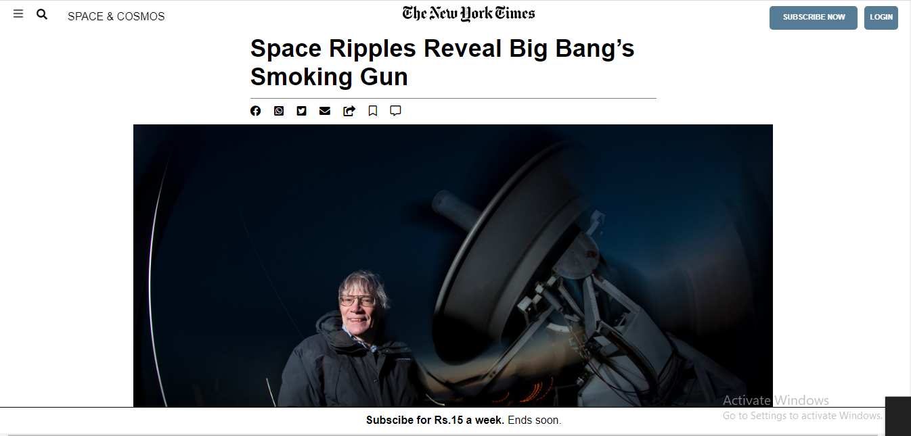

# New_yorkcity
This is The new york times html page.
In the process of making this website,I learn some  techniques like float, position, grid, flex property which made our project more flexible.

# Original Design

Original Design link : [nytimes.com](https://www.nytimes.com/2014/03/18/science/space/detection-of-waves-in-space-buttresses-landmark-theory-of-big-bang.html?_r=0)
  
# Project Design

Project Design Screenshot : 

# Github link:

For the: [Github-link](https://github.com/Deepakdanger/New_yorkcity/tree/New_york1)

## Navigation bar

- Used flex to create three division one for icon, second one for logo and last one for login and subscribe button.

## Image section

- Used img and put an image to the center. 

## Article section

- Embedded videos using iframe, insert images and paragraphs in this section.

## Inflation section

- Used image and description and using grid for fixed section.
- Relative position property is used for the image.

## Editor's section

- Use aside tag for float and position absolute.

## Footer section

- float property is used to put logo in one side and text in other side.
- Flex box are used
- Fixed footer is made using fixed and sticky property.

# Technology Used

- HTML
- CSS
- Font Awesome icons

# Authors
Name :Deepak kumar
Githhub :https://github.com/Deepakdanger
